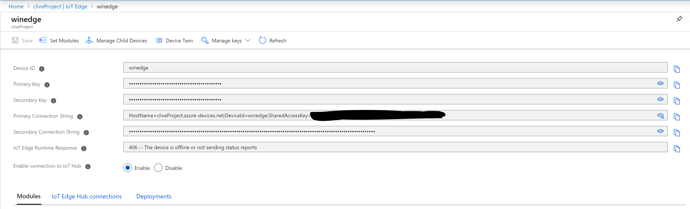
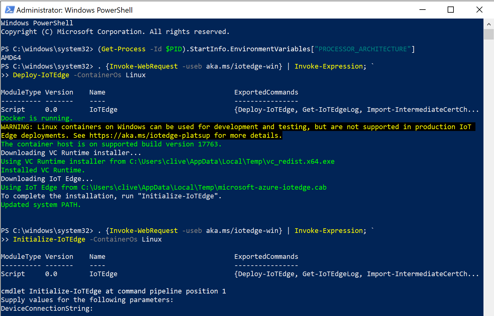
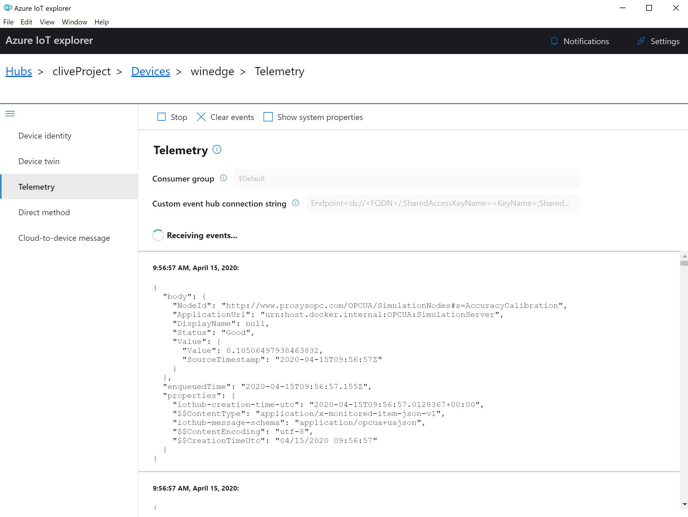
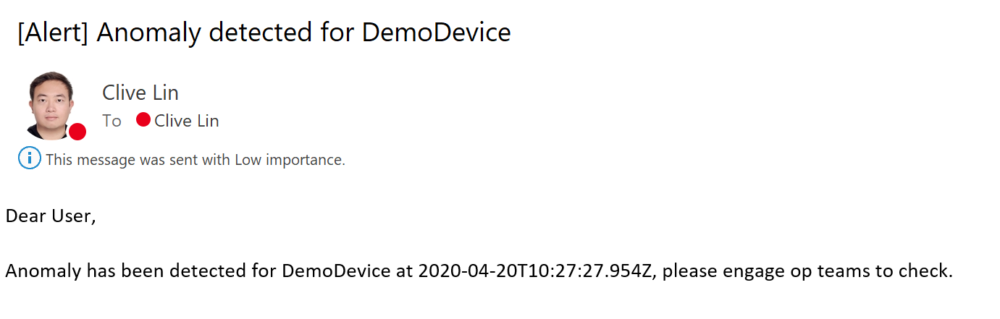

# FromFactoryToOffice

This is a brief demo and sample tutorial to introduce Azure IoT/AI functionalities to whom is interested in integrating IoT/AI with factory data. 

It mainly contains two parts: Part I of introducing IoT Edge working with Factory Data collecting modules and Machine Learning Module, and Part II of processing and reacting to device data from cloud side.

Combination of the two parts will outline a graph of how we get traditional factory data to user’s desktop, and interact with the data.

## Prerequisites:

(a)	An active Azure subscription.

(b)	An Windows 10 machine to run IoT Edge Linux containers on, which needs to meet the [requirements for Docker Desktop]( https://docs.microsoft.com/en-us/azure/iot-edge/how-to-install-iot-edge-windows-with-linux#supported-windows-versions).

If you use an Azure Win 10 VM like me, you may need to create at least Dv3 or Ev3 series or higher to be able to use [nested virtualization](https://docs.microsoft.com/en-us/azure/virtual-machines/windows/nested-virtualization#create-a-nesting-capable-azure-vm).

## Part I: IoT Edge

[Azure IoT Edge](https://docs.microsoft.com/en-us/azure/iot-edge/about-iot-edge) moves cloud analytics and custom business logic to edge devices in the form of containers/modules. 

In this part we are going to build an edge device that has an OPC Publisher module, which subscribes to data nodes of other OPC UA server; a Sensor module, which will simulate collecting temperature/humidity data of the current device; and also an Azure Machine Learning module to do anomaly detection for the device data and tag it before sending to cloud.

### Create IoT Hub and Edge device identity on Azure Portal

(1)	Navigate to [Azure Portal](https://ms.portal.azure.com/) and choose to create a new IoT Hub.

(2)	After IoT Hub is created, navigate to the “IoT Edge” option and create a new IoT Edge device, then click the created edge device and get the primary connection string information.

### Install IoT Edge with Linux container on your Win10 device:

(3)	We need to first [install Docker desktop](https://hub.docker.com/editions/community/docker-ce-desktop-windows).
After Docker is installed, make sure in the settings that you are using Linux container, and to enable Docker’s file sharing with local storage.

(4)	Then we can follow the tutorial – [Use IoT Edge on Windows to run Linux containers](https://docs.microsoft.com/en-us/azure/iot-edge/how-to-install-iot-edge-windows-with-linux) to install IoT Edge on your device.
When prompted for your device connection string, input the one we get in step (2).

### Setup OPC Publisher module and monitor output

(5)	In this demo we use an OPC UA Simulation Server to generate data in the same format as a real OPC UA server. You can download the Simulation Server from [Prosys](https://www.prosysopc.com/products/opc-ua-simulation-server/).

(6)	After installing the OPC UA Simulation Server, copy the TCP address shown on the main page. Here we recommend to replace the machine name with the IP address of this machine, to avoid potential URI corruption. 
The final format should be like:  opc.tcp://52.191.165.152:53530/OPCUA/SimulationServer 

(7)	Change the data type name to anything you like, here we modified and used AccuracyCalibration and ProductCount, to simulate two kinds of data we receive from the OPC UA factory devices.

(8)	Enable Expert Mode in OPC UA Simulation Server option, and go to Address Space – Objects -Simulation to copy the node IDs of the above mentioned two data nodes.

(9)	In the Win10 machine, create a folder “iiotedge” under C drive and create a file pn.json in folder “iiotedge”, and input following content in pn.json.

**[
  {
    "EndpointUrl": "opc.tcp://{Your machine IP Address}/OPCUA/SimulationServer",
    "UseSecurity": false,
    "OpcNodes": [
      {
        "Id": "{Node1 ID}"
      },
      {
        "Id": "{Node2 ID}"
      }
    ]
  }
]**

Example:

**[
  {
    "EndpointUrl": "opc.tcp://52.191.165.152:53530/OPCUA/SimulationServer",
    "UseSecurity": false,
    "OpcNodes": [
      {
        "Id": "ns=3;s=ProductCounter"
      },
      {
        "Id": "ns=3;s=AccuracyCalibration"
      }
    ]
  }
]**

(10)	Navigate to IoT Edge module market and get to [OPC Publisher module]( https://azuremarketplace.microsoft.com/en/marketplace/apps/microsoft_iot.iotedge-opc-publisher?tab=Overview) and click “Get it now” – “Continue”, then choose the IoT Edge device we already created and you will be redirected to the module setting page.

Then click the name of the OPC Publisher module to get to the container create option. 

Replace the whole thing with following content. 

**{
    "Hostname": "publisher",
    "Cmd": [
        "publisher",
        "--pf=/appdata/pn.json",
        "--di=60",
        "--to",
        "--aa",
        "--si=10",
        "--ms=262144"
    ],
    "HostConfig": {
        "PortBindings": {
            "62222/tcp": [
                {
                    "HostPort": "62222"
                }
            ]
        },
        "Binds": [
            "c:/iiotedge:/appdata"
        ],
        "ExtraHosts": [
            "localhost:127.0.0.1"
        ]
    }
}**

Then click Update and continue to Route setting, where we set the rout as following, which will route all output from OPCPublisher to IoT Hub:
opcToIoTHub: FROM /messages/modules/OPCPublisher/* INTO $upstream 

Then continue to create the deployment, and after a while, you should see from your portal that the modules are all running. 

You can also confirm from your Win10 machine by running **iotedge list** in Powershell and should see following:

By running **iotedge logs OPCPublisher**, you could see activity logs of OPC Publisher module as following, which indicates there were already 227 message collected from the Simulation Server and forwarded to IoT Hub.

(11)	We can also use [Azure IoT Explorer](https://github.com/Azure/azure-iot-explorer/releases) to monitor the actual data sent to IoT Hub. For connecting Azure IoT Explorer, we use the **iothubowner** policy connection string of IoT Hub as following:

After connected, navigate to “Devices” and click the name of your IoT Edge device, and choose the Telemetry option to start monitoring OPC UA data sent to IoT Hub.

### Setup Sensor module and Machine Learning module and monitor output

(12)	 In this demo we use the tutorial – [Deploy Azure Machine Learning as an IoT Edge module](https://docs.microsoft.com/en-us/azure/iot-edge/tutorial-deploy-machine-learning) to simulate the Anomaly Detection for edge devices using Deep Learning models.

(13)	 Basically we can just go through the above tutorial to get the both modules deployed to your edge device. The only difference is that you already have the IoT Edge device ready, so just skip the edge device creation part, and use your existing IoT Edge device information.

(14)	 When deploying the modules to edge device, remember to also include your previous OPCPublisher module in the list, so that it can stay on your edge device.

The two routes “tempSensor to ML module” and “ML module to cloud” will be automatically added for you, so make sure there are three routes in total as following:

(15)	 After finishing deployment, run **iotedge list** to make sure all modules are running.

By running **iotedge logs machinelearningmodule**, you could see activity logs of machine learning module as following, which indicates each classification it responses based on the device data, on whether the data is anomaly (1) or not (0).

Using IoT Explorer again, we could see the machine learning module processed data has also arrived.

We can see the anomaly tag Machine Learning module added for the device data.

## Part II: IoT Hub message processing

[Azure IoT Hub](https://docs.microsoft.com/en-us/azure/iot-hub/about-iot-hub ) is the entrance of all Azure IoT traffic and has many integrations with other Azure Services to handle these IoT data.
In this part we are going to use a simulated device client to send simulated IoT data, in the similar format we have in Part I. 
(Didn’t directly use raw data from Part I since the they are not of application/json type, so will get encrypted during IoT Hub processing. If you would like to use Part I data, you may need to engage another module to convert the type to application/json first.)

(1)	Create an IoT Device (Not Edge Device) in the same IoT Hub and get the primary connection string. 

(2)	Make sure your local machine meets the [requirement to run the SDK](https://docs.microsoft.com/en-us/azure/iot-hub/quickstart-send-telemetry-dotnet#prerequisites). Then download the [Simulated Device project folder](SimulatedDevice/SimulatedDevice.cs), and navigate to the folder you downloaded, replace the {device connection string} part with the string copied in step (1).

Run **dotnet restore** and then *dotnet run*, to start sending simulated data as following:

### Create email three kinds of alerts for device status and data
(3)	Refer to this tutorial – [Send email notifications about Azure IoT Hub events using Event Grid and Logic Apps](https://docs.microsoft.com/en-us/azure/event-grid/publish-iot-hub-events-to-logic-apps) to create and configure the Event Grid event subscription and the relevant logic app.

**(a)	For Device Status Alert:**

Logic App sample JSON payload please use DeviceConnected Schema in the [schema list](https://docs.microsoft.com/en-us/azure/event-grid/event-schema-iot-hub#example-event) 

Logic App email setting:

Event Grid configuration is as following:

Alert email content we receive:

**(b)	For Product Count Alert:**

Logic App sample JSON payload please use DeviceTelemetry Schema as following:

[{
  "id": "9af86784-8d40-fe2g-8b2a-bab65e106785",
  "topic": "/SUBSCRIPTIONS/<subscription ID>/RESOURCEGROUPS/<resource group name>/PROVIDERS/MICROSOFT.DEVICES/IOTHUBS/<hub name>", 
  "subject": "devices/LogicAppTestDevice", 
  "eventType": "Microsoft.Devices.DeviceTelemetry",
  "eventTime": "2019-01-07T20:58:30.48Z",
  "data": {        
      "body": {            
          "productTotal": 450       
      },
        "properties": {            
          "Status": "Active"        
        },
        "systemProperties": {            
            "iothub-content-type": "application/json",
            "iothub-content-encoding": "utf-8",
            "iothub-connection-device-id": "d1",
            "iothub-connection-auth-method": "{\"scope\":\"device\",\"type\":\"sas\",\"issuer\":\"iothub\",\"acceptingIpFilterRule\":null}",
            "iothub-connection-auth-generation-id": "123455432199234570",
            "iothub-enqueuedtime": "2019-01-07T20:58:30.48Z",
            "iothub-message-source": "Telemetry"        
        }    
    },
  "dataVersion": "",
  "metadataVersion": "1"
}]

Logic App email setting:

Event Grid configuration is as following:

Alert email content we receive:

**(c)	For Device Status Alert:**

Logic App sample JSON payload please use DeviceTelemetry Schema as following:

[{
  "id": "9af86784-8d40-fe2g-8b2a-bab65e106785",
  "topic": "/SUBSCRIPTIONS/<subscription ID>/RESOURCEGROUPS/<resource group name>/PROVIDERS/MICROSOFT.DEVICES/IOTHUBS/<hub name>", 
  "subject": "devices/LogicAppTestDevice", 
  "eventType": "Microsoft.Devices.DeviceTelemetry",
  "eventTime": "2019-01-07T20:58:30.48Z",
  "data": {        
      "body": {            
          "anomaly": 1      
      },
        "properties": {            
          "Status": "Active"        
        },
        "systemProperties": {            
            "iothub-content-type": "application/json",
            "iothub-content-encoding": "utf-8",
            "iothub-connection-device-id": "d1",
            "iothub-connection-auth-method": "{\"scope\":\"device\",\"type\":\"sas\",\"issuer\":\"iothub\",\"acceptingIpFilterRule\":null}",
            "iothub-connection-auth-generation-id": "123455432199234570",
            "iothub-enqueuedtime": "2019-01-07T20:58:30.48Z",
            "iothub-message-source": "Telemetry"        
        }    
    },
  "dataVersion": "",
  "metadataVersion": "1"
}]

Logic App email setting:

Event Grid configuration is as following:

Alert email content we receive:

### Visualize and analyze IoT Hub data with Power BI
(4)	Refer to [this tutorial](https://github.com/microsoft/MCW-Internet-of-Things/blob/master/Hands-on%20lab/HOL%20step-by-step%20-%20Internet%20of%20Things.md#exercise-3-hot-path-data-processing-with-stream-analytics) to configure the iot hub as input of Stream Analytics and Power BI as output.

(5) Diffrecence from the tutorial is that we calculate average accuracyCalibration values, divided by the anomaly situation of device telemetry.

(6)	We can get a visualized graph of how Average Accuracy Calibration was impacted by whether the situation is anomaly or not.

## References:

https://docs.microsoft.com/en-us/azure/iot-edge/how-to-install-iot-edge-windows-with-linux 

https://sandervandevelde.wordpress.com/2018/11/06/getting-started-with-opc-ua-on-azure-iot-edge/

https://docs.microsoft.com/en-us/azure/iot-edge/tutorial-deploy-machine-learning

https://docs.microsoft.com/en-us/azure/event-grid/publish-iot-hub-events-to-logic-apps 

https://github.com/microsoft/MCW-Internet-of-Things/blob/master/Hands-on%20lab/HOL%20step-by-step%20-%20Internet%20of%20Things.md#exercise-3-hot-path-data-processing-with-stream-analytics
